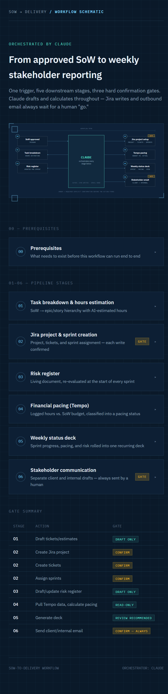
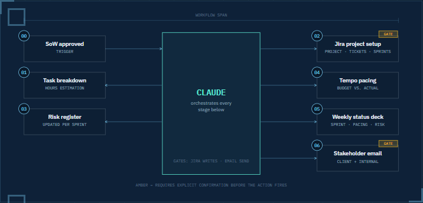

# SoW-To-Delivery-Workflow

A single-page HTML schematic showing a workflow from an approved Statement of Work (SoW) to weekly stakeholder reporting.

The page is styled as a dark-theme dashboard and includes:
- an overview diagram of stages and confirmation gates
- stage details for prerequisites, Jira setup, risk register, financial pacing, reporting, and stakeholder communication
- a smooth scroll navigation experience built into the SVG diagram

## Files

- `sow-to-delivery-workflow.html` – the main workflow schematic page
- `sow-to-delivery-workflow-full.png` – full-page screenshot of the rendered HTML
- `sow-to-delivery-workflow-diagram.png` – focused screenshot of the workflow diagram section

## Preview

## How to view

Open `sow-to-delivery-workflow.html` in a browser. The file is a self-contained static HTML page and requires no build steps.

## Notes

- The HTML uses an embedded SVG diagram and inline CSS.
- The design highlights AI-assisted workflow orchestration with explicit manual gates for Jira writes and outgoing email.
